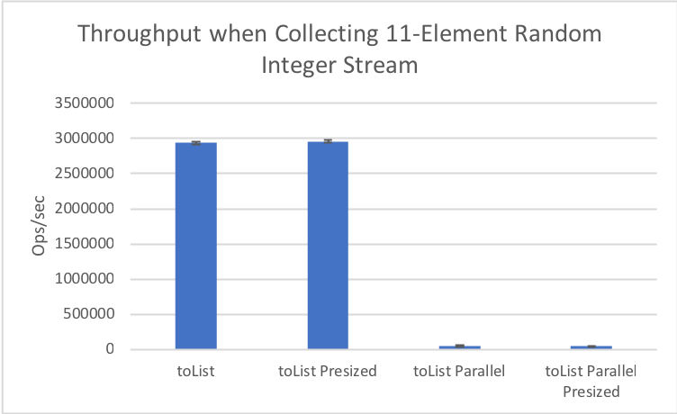
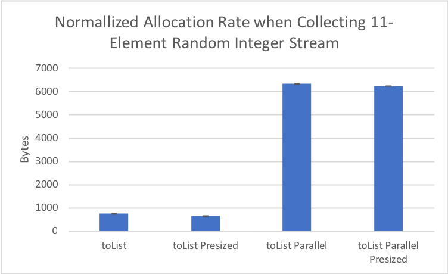
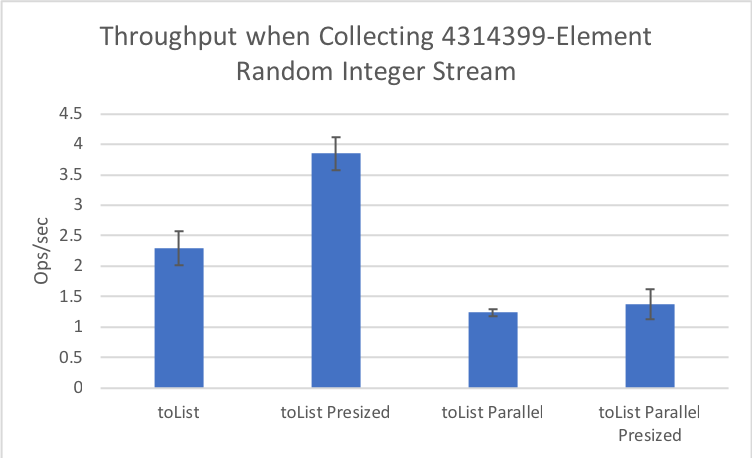
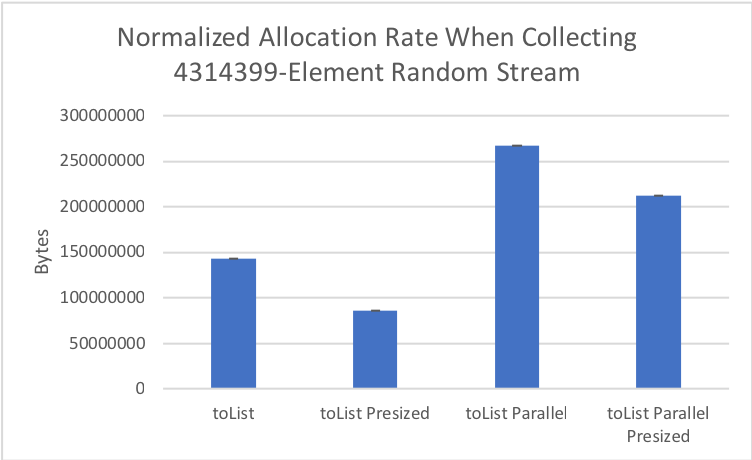
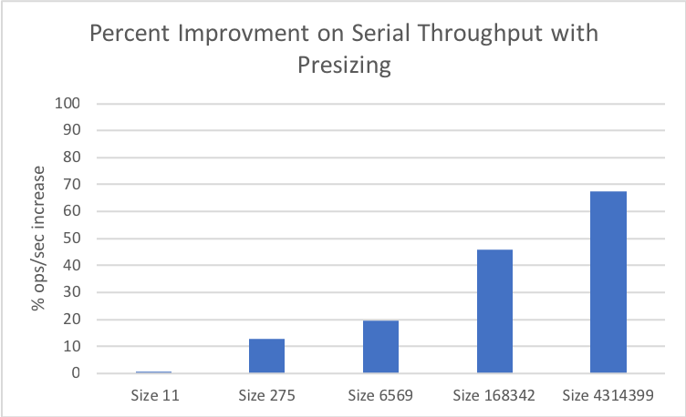
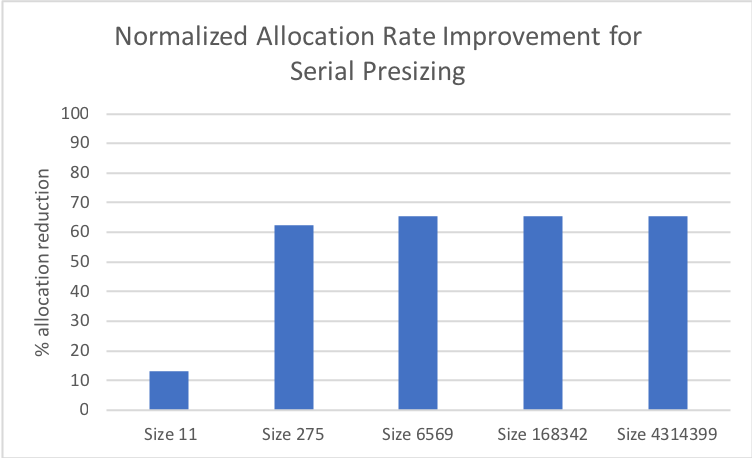
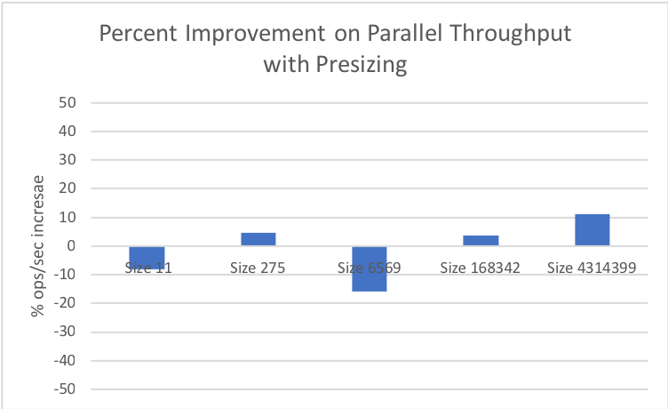
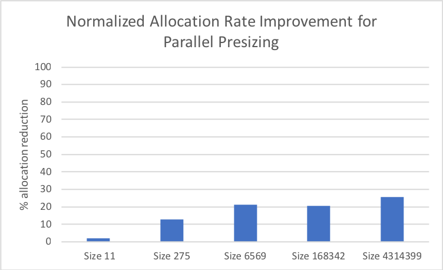

Some benchmarks showing the throughput and allocation benefit of pre-sizing collectors.

Each benchmark takes a Stream of random integers of size `s`, and collects the results into a List<Integer> using an ArrayList-backed Collector.

The values of `s` tested are 11, 275, 6569, 168342, and 4314399. These were chosen to provide a 'best case' improvement, as ArrayLists will be most over-sized at these element counts. ArrayList has an initial capacity of 10, and grows to (size + size * 1.5) when its internal array hits max capacity.

```java
    int[] sizes = IntStream.iterate(0, i -> i + 8)
        .map(i -> (int) (10 * Math.pow(1.5,i) + 1))
        .limit(5)
        .toArray();
```

To Run the benchmarks, [this webrev](webrev.zip) must be applied to a jdk 13 build (viewable [here](http://august.nagro.us/presized-collectors/webrev/))

## Results:
Here are some graphs after running with `-prof gc` on my 2015 Macbook Pro:











In summary, we see that there is:
* Notable allocation decrease for both serial and parallel streams
* Significant throughput improvement for bare-bones serial collection, although the benefit is likely insignificant in non-trivial streams. This might explain why the parallel stream benchmarks have no noticeable change in throughput (ie, the copying in Collector::combiner dominates the runtime).
